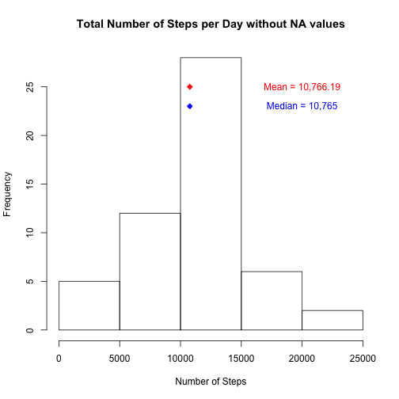
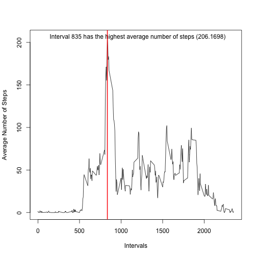
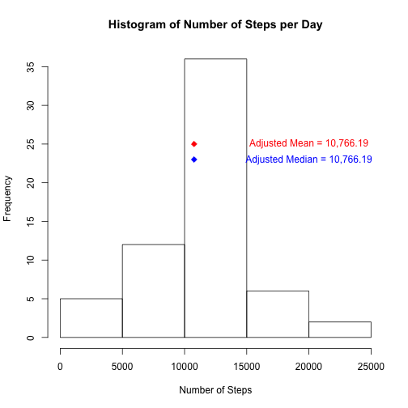
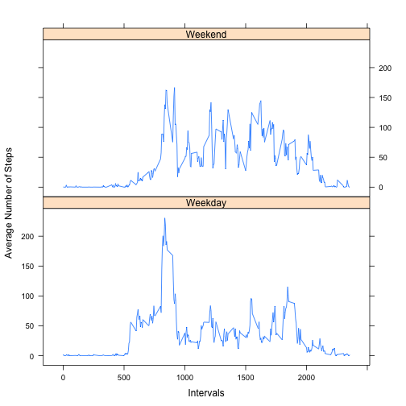

## Assignment 1

Loading Data, taking a look at the what is there...


```r
ActivityData <- read.csv("activity.csv", header = TRUE, sep = ",")
```

Calculating and graphing a few things:

* total number of steps per day
* mean and median number of steps per day
* both graphed on a histogram

Note: I needed to convert the mean and median into characters to get them formatted to print on the graph. Also, since the mean and median overlapped, I separated the labels vertically to make them readable.


```r
# sum by date, convert to data frame, calculate mean and median
NumberOfSteps <- tapply(ActivityData$steps, ActivityData$date, sum)
NumberOfSteps <- as.data.frame(NumberOfSteps)
colnames(NumberOfSteps) <- "Steps" 
meanSteps <- mean(NumberOfSteps$Steps, na.rm = TRUE)
medianSteps <- median(NumberOfSteps$Steps, na.rm = TRUE)

# plot histogram, adding symbols and text labels for mean and median
hist(NumberOfSteps$Steps, main = "Total Number of Steps per Day without NA values", xlab = "Number of Steps")
points(medianSteps, 23, pch = 23, col = "blue", bg = "blue")
points(meanSteps, 25, pch = 23, col = "red", bg = "red")

formatMean <- format(mean(NumberOfSteps$Steps, na.rm = TRUE), digits = 2, big.mark = ",", nsmall = 2)
formatMedian <- format(median(NumberOfSteps$Steps, na.rm = TRUE), digits = 2, big.mark = ",", nsmall = 2)
medianLabel <- paste("Median", formatMedian,  sep = " = ")
meanLabel <- paste("Mean", formatMean, sep = " = ")
text(20000, 23, labels = medianLabel,  cex = 1, col = "blue")
text(20000, 25, labels = meanLabel, cex = 1, col = "red")
```

 

Now let's look at the average daily activity pattern.
I am plotting the average number of steps throughout the 2,355 five minute intervals in a 24 hour period.
I'm adding a vertical line at the highest average in those time intervals.


```r
# average by interval, remove NA's for graphing, turn into data frame, add a column for intervals (from rownames), calculate max interval
AvgStepsPerInterval <- tapply(ActivityData$steps, ActivityData$interval, mean, na.rm = TRUE)
AvgStepsPerInterval <- as.data.frame(AvgStepsPerInterval)
tmp <- as.numeric(rownames(AvgStepsPerInterval))
AvgStepsPerInterval$Interval <- tmp
MaxSteps <- max(AvgStepsPerInterval$AvgStepsPerInterval)
Interval <- AvgStepsPerInterval[AvgStepsPerInterval$AvgStepsPerInterval == MaxSteps, 2]

plot(AvgStepsPerInterval$AvgStepsPerInterval ~ AvgStepsPerInterval$Interval, type = "l", ylab = "Average Number of Steps", xlab = "Intervals")

text(1200, MaxSteps, labels = "Interval 835 has the highest average number of steps (206.1698)")
abline(v=Interval, col = "red", lwd = 2)
```

 

What effect do the missing data have on the outcome?

How many values are missing?


```r
MissingData <- is.na(ActivityData$steps)
length(MissingData[MissingData == TRUE])
```

```
## [1] 2304
```

I'll fill in approximate values using the mean of that interval that was calculated above.


```r
# Take a copy of the original data, subset the NAs only, fill in avg steps per interval, load back into the full data frame, take out NAs again
ActivityDataAdj <- ActivityData
x <- subset (ActivityDataAdj, is.na(ActivityDataAdj$steps))
x$steps[x$interval==AvgStepsPerInterval$Interval] <- AvgStepsPerInterval$AvgStepsPerInterval
CombinedData <- rbind(ActivityDataAdj, x)
CombinedData <- subset(CombinedData, !is.na(CombinedData$steps))

# sum by date, convert to data frame, calculate mean and median
AdjNumberOfSteps <- tapply(CombinedData$steps, CombinedData$date, sum)
AdjNumberOfSteps <- as.data.frame(AdjNumberOfSteps)
colnames(AdjNumberOfSteps) <- "Steps" 

AdjmeanSteps <- mean(AdjNumberOfSteps$Steps, na.rm = TRUE)
AdjmedianSteps <- median(AdjNumberOfSteps$Steps, na.rm = TRUE)

hist(AdjNumberOfSteps$Steps, main = "Histogram of Number of Steps per Day", xlab = "Number of Steps")
points(AdjmedianSteps, 23, pch = 23, col = "blue", bg = "blue")
points(AdjmeanSteps, 25, pch = 23, col = "red", bg = "red")

formatMean <- format(mean(AdjNumberOfSteps$Steps, na.rm = TRUE), digits = 2, big.mark = ",", nsmall = 2)
formatMedian <- format(median(AdjNumberOfSteps$Steps, na.rm = TRUE), digits = 2, big.mark = ",", nsmall = 2)
medianLabel <- paste("Adjusted Median", formatMedian,  sep = " = ")
meanLabel <- paste("Adjusted Mean", formatMean, sep = " = ")
text(20000, 23, labels = medianLabel,  cex = 1, col = "blue")
text(20000, 25, labels = meanLabel, cex = 1, col = "red")
```

 

So - using the methodolgy of taking the mean of each interval and replacing the NAs - does not affect the outcome.

Are there differences between weekdays and weekends?
Using the combined (original + estimated steps) data, calculate and graph the difference between weekdays and weekends.


```r
CombinedData$DayOfWeek <- weekdays(as.Date(CombinedData$date))
CombinedData$WeekDayOrWeekend[CombinedData$DayOfWeek %in% c("Monday", "Tuesday", "Wednesday", "Thursday", "Friday")] <- "Weekday"
CombinedData$WeekDayOrWeekend[CombinedData$DayOfWeek %in% c("Saturday", "Sunday")] <- "Weekend"
Interval <- as.numeric(unique(CombinedData$interval))

# subset by weekday/weekend, then tapply by interval
WeekDay <- subset(CombinedData, CombinedData$WeekDayOrWeekend == "Weekday")
WeekEnd <- subset(CombinedData, CombinedData$WeekDayOrWeekend == "Weekend")
WeekDayTotal <- as.numeric(tapply(WeekDay$steps, WeekDay$interval, mean))
WeekEndTotal <- as.numeric(tapply(WeekEnd$steps, WeekEnd$interval, mean))

# add back intervals and combine back into a dataframe using a factor type for day type
WeekDayTotal <- data.frame(AvgNumberOfSteps = WeekDayTotal, Interval = Interval, WeekEndOrDay = "Weekday")
WeekEndTotal <- data.frame(AvgNumberOfSteps = WeekEndTotal, Interval = Interval, WeekEndOrDay = "Weekend")
dfPlot <- rbind(WeekDayTotal, WeekEndTotal)

library(lattice)
xyplot(AvgNumberOfSteps ~ Interval | WeekEndOrDay, data = dfPlot, ylab = "Average Number of Steps",
       xlab = "Intervals", layout = c(1, 2), type = "l", lty = 1)
```

 


